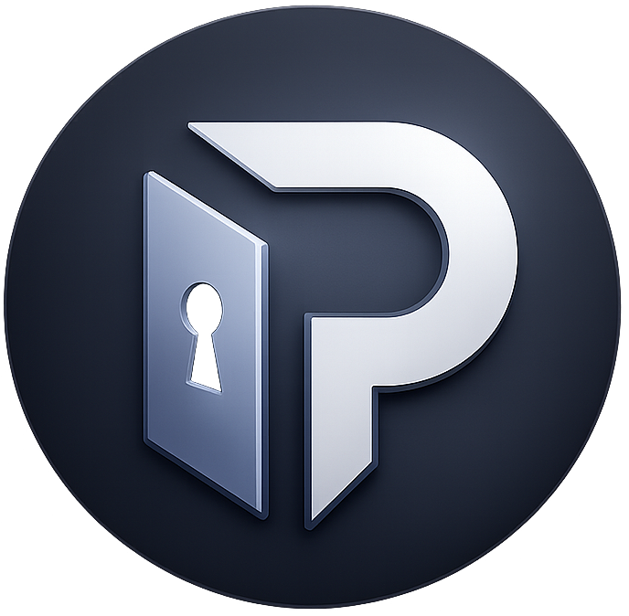
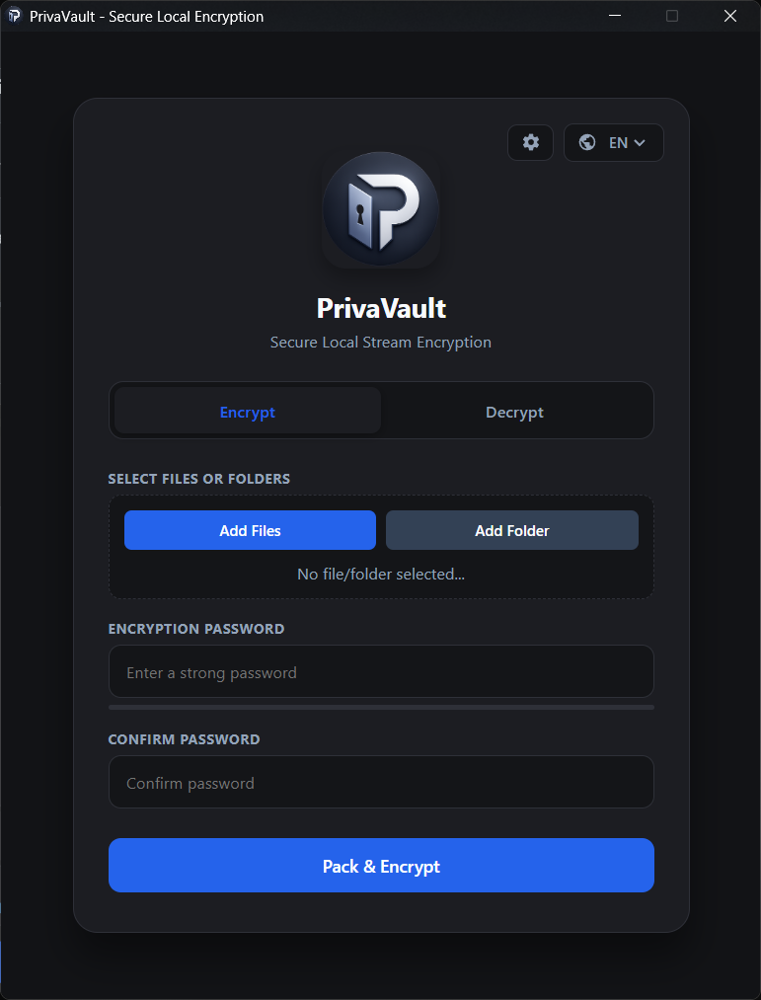

<div align="center">
  
  <h1>PrivaVault 🔒</h1>
  <p>
    <b>Modern, Ultra-Secure, Zero-Knowledge Desktop File Encryption Application</b><br>
    <i>High-Performance Offline Stream Encryption Powered by Electron & Node.js</i>
  </p>

  <p>
    <a href="https://github.com/TNFX1/PrivaVault/releases"></a>
    <a href="#-security--cryptography-architecture"></a>
    <a href="#-installation--usage"></a>
    <a href="LICENSE"></a>
  </p>

  ---
</div>

## 📌 Table of Contents
- [🌟 Overview](#-overview)
- [💡 Why PrivaVault?](#-why-privavault)
- [✨ Key Features](#-key-features)
- [📷 Application Preview](#-application-preview)
- [🛡️ Security & Cryptography Architecture](#-security--cryptography-architecture)
- [📂 Project Structure](#-project-structure)
- [💻 Installation & Usage](#-installation--usage)
  - [🪟 Windows Executables](#-windows-executables)
  - [🐧 Linux Packages](#-linux-packages)
  - [🛠️ Build from Source](#️-build-from-source)
- [📖 How It Works](#-how-it-works)
- [❓ Frequently Asked Questions](#-frequently-asked-questions)
- [⚠️ Disclaimer](#️-disclaimer--limitation-of-liability)
- [📄 License](#-license)

---

## 🌟 Overview

**PrivaVault** is an advanced, desktop-native file encryption tool engineered with **Electron** and **Node.js stream processing**. It enables users to bundle, encrypt, inspect, and extract single or multiple files locally with absolute privacy.

> 🔒 **100% Zero-Knowledge & Offline**
> Unlike web-based tools restricted by browser memory limits or cloud services storing data on remote servers, PrivaVault processes everything **locally on your device**. Passwords, encryption keys, and raw data **never leave your system**.

---

## 💡 Why PrivaVault?

- **True Zero-Knowledge Security:** Your master passwords and raw files never leave your machine—no servers, backdoors, or telemetry.
- **Unrestricted File Sizes:** High-performance Node.js stream encryption handles multi-gigabyte files effortlessly without high RAM consumption.
- **Container Flexibility:** Bundle multiple files or folders into custom-encrypted archives (`.pvault`, `.enc`) with real-time inspection capabilities.
- **Cross-Platform Readiness:** Native executables and packages engineered for Windows as well as major Linux distributions (`.deb`, `.rpm`, `AppImage`).
- **Transparent & Open-Source:** Fully open-source codebase licensed under MIT, giving you complete visibility and control over your data security.

---

## ✨ Key Features

| Feature | Highlight | Description |
| :--- | :--- | :--- |
| 🖥️ **Native Performance** | **Node.js Streams** | Process multi-gigabyte files chunk-by-chunk with minimal RAM footprint. |
| 🐧 **Cross-Platform** | **Windows & Linux** | Native support for Windows Installers, Portable executables, `.deb`, `.rpm`, and `AppImage`. |
| 🔐 **Zero-Knowledge** | **100% Offline** | Complete privacy guarantee. No telemetry, network calls, or analytics. |
| 📦 **Vault Multi-Container** | **Bundle Any File** | Combine multiple files into a single custom vault container (`.pvault`, `.enc`, etc.). |
| 🔍 **Container Inspection** | **Safe Preview** | Inspect file listings, metadata, and container structures without extracting files to disk. |
| 🎯 **Selective Extraction** | **Batch / Single** | Unpack individual files selectively or extract all contents into a folder or `.zip` archive. |
| 🛡️ **Military-Grade Spec** | **AES-256-GCM** | Authenticated stream encryption coupled with **PBKDF2-SHA256** key derivation. |
| ⚡ **Live Feedback** | **Real-Time UI** | Visual progress indicators and speed feedback during heavy encryption jobs. |

---

## 📷 Application Preview

<div align="center">
  
</div>

---

## 🛡️ Security & Cryptography Architecture

PrivaVault enforces high-level cryptographic standards to guarantee confidentiality and data integrity:

```text
  [ User Password ] ──► [ Salt (16-Byte) ] ──► [ PBKDF2-SHA256 (100k+ Iterations) ] ──► [ Derived 256-Bit Key ]
                                                                                                 │
  [ Raw Data File Stream ] ─────────────────► [ AES-256-GCM Stream Engine ] ◄────────────────────────┘
                                                         │
                                                         ▼
                       [ Salt | IV | Iterations | Ciphertext Stream | 16-Byte Auth Tag ] ──► (.pvault)
```

1. **AES-256-GCM (Galois/Counter Mode):** Symmetric encryption paired with cryptographic authentication. Any byte-level alteration or corruption triggers an instant validation error during decryption.
2. **PBKDF2-SHA256 Key Derivation:** Password hashing using configurable iteration counts (100,000+ iterations recommended) to prevent dictionary and GPU-accelerated brute-force attacks.
3. **Dynamic Header Structure:** Every `.pvault` file incorporates a structured header storing key metadata (16-byte Salt, 12-byte IV, Iteration count, and 16-byte Auth Tag).

---

## 📂 Project Structure

```text
PrivaVault/
├── .github/
│   └── workflows/
│       └── build.yml       # GitHub Actions CI/CD release workflow
├── assets/                 # App logos and interface preview graphics
│   ├── logo.png
│   └── preview.png
│   └──  logo.ico
├── index.html              # Modern User Interface (HTML5 / CSS3 / JS)
├── main.js                 # Electron main process & IPC message handlers
├── preload.js              # Context-isolated secure IPC bridge
├── package.json            # Manifest, dependencies, and electron-builder setup
└── README.md               # Application documentation
```

---

## 💻 Installation & Usage

Visit the **[Releases](https://github.com/TNFX1/PrivaVault/releases)** section to download the executable or package for your system.

### 🪟 Windows Executables
- `PrivaVault-Setup-1.3.6.exe` *(Standard Windows Installer – Double click to install)*
- `PrivaVault-Portable-1.3.6.exe` *(Portable Executable – Double click to run immediately)*

---

### 🐧 Linux Packages & Binaries

#### 📦 Debian / Ubuntu / Linux Mint (`.deb`)
1. Download `PrivaVault-1.3.6.deb`.
2. Install via terminal:
   ```bash
   sudo apt install ./PrivaVault-1.3.6.deb
   ```

#### 📦 Fedora / RHEL / CentOS (`.rpm`)
1. Download `PrivaVault-1.3.6.rpm`.
2. Install via terminal:
   ```bash
   sudo dnf install ./PrivaVault-1.3.6.rpm
   ```

#### 🚀 Arch Linux / Manjaro / Universal (`AppImage`)
`AppImage` files are standalone executables that do not require installation.

**Step 1: Make it Executable & Run Directly**
```bash
chmod +x PrivaVault-1.3.6.AppImage
./PrivaVault-1.3.6.AppImage
```

**Step 2 (Optional): System & Application Launcher Integration** If you want PrivaVault to appear in your desktop application menu, install `AppImageLauncher`:
```bash
# On Arch Linux / Manjaro
yay -S appimagelauncher
```
Once installed, double-clicking `PrivaVault-1.3.6.AppImage` will integrate it into your system application menu automatically.

---

### 🛠️ Build from Source

Requirements: **Node.js v18+** & **npm**

```bash
# Clone the repository
git clone [https://github.com/TNFX1/PrivaVault.git](https://github.com/TNFX1/PrivaVault.git)

# Navigate into project directory
cd PrivaVault

# Install dependencies
npm install

# Run application in development mode
npm start

# Build production binaries
npm run build
```

---

## 📖 How It Works

### 🔐 Encrypting Files (Creating a Vault)
1. Open **PrivaVault** and switch to the **Encrypt** tab.
2. Click **Select Files** to add one or more files to protect.
3. Set a strong password and iteration count (default: `100,000`).
4. Choose your custom file extension (default: `.pvault`).
5. Click **Encrypt & Save** to stream-encrypt your archive.

### 🔓 Inspecting & Extracting Vaults
1. Switch to the **Decrypt / Vault Manager** tab.
2. Select your encrypted file (`.pvault`) and enter the password.
3. **Inspect Content:** Preview embedded directory structures and individual file sizes securely.
4. **Selective Extract:** Unpack a specific file directly to your target path.
5. **Extract All:** Unpack the whole archive to a specified directory or a ZIP container.

---

## ❓ Frequently Asked Questions

<details>
  <summary><b>Q: What happens if I forget my encryption password?</b></summary>
  <br>
  PrivaVault operates on strict zero-knowledge principles. Because no keys or recovery backdoors are stored anywhere, forgotten passwords <b>cannot be recovered under any circumstances</b>.
</details>

<details>
  <summary><b>Q: Is there a maximum file size limit for encryption?</b></summary>
  <br>
  No! Thanks to Node.js stream processing, data is read and encrypted chunk-by-chunk from disk. You can encrypt files exceeding 50GB+ smoothly with low memory usage.
</details>

<details>
  <summary><b>Q: Does PrivaVault make network calls or store telemetry?</b></summary>
  <br>
  No. PrivaVault functions 100% offline. No telemetry, external API requests, or tracking mechanisms exist in the codebase.
</details>

---

## ⚠️ Disclaimer & Limitation of Liability

**PrivaVault** is provided **"as is"**, without warranty of any kind, express or implied.

- **Data Safety:** Users are solely responsible for keeping safe backups of their original unencrypted files and maintaining records of their passwords.
- **Zero-Knowledge Warning:** Due to local zero-knowledge processing, forgotten passwords or corrupted files cannot be recovered by the developers.
- **No Liability:** In no event shall the authors or copyright holders be liable for any data loss, file corruption, lost passwords, or direct/indirect damages arising from the use of this software.

---

## 📄 License

Distributed under the open-source **[MIT License](LICENSE)**.
