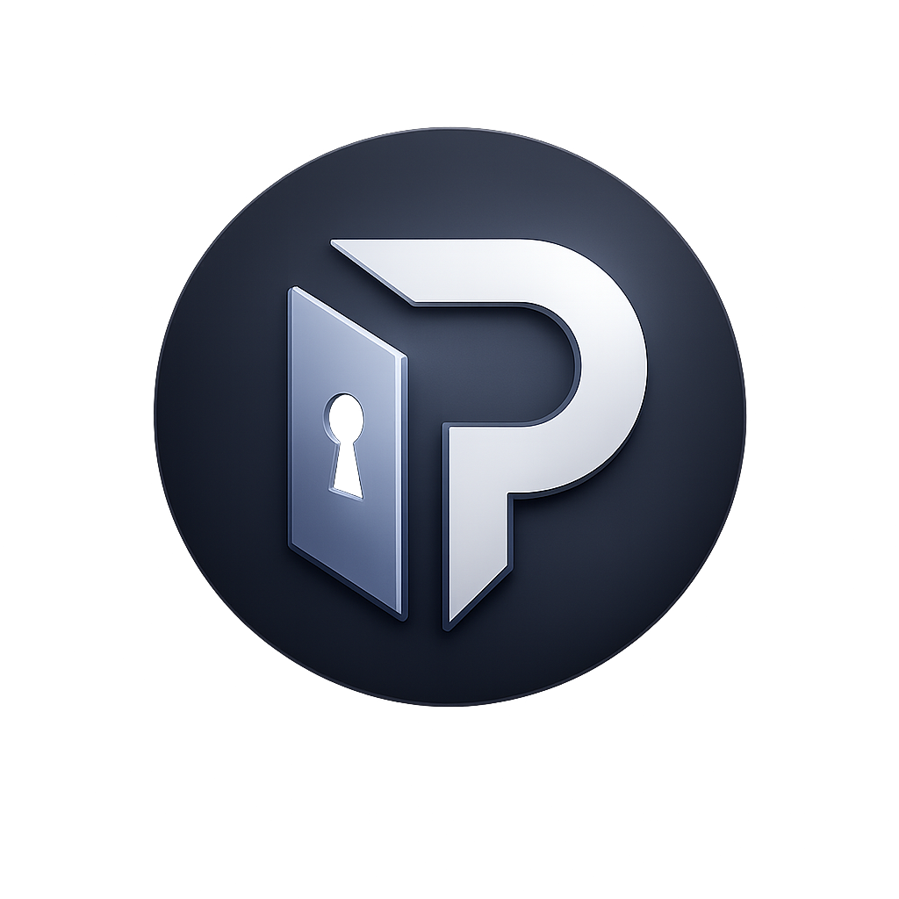

<div align="center">
  
  
  # PrivaVault 🔒
  
  <p align="center">
    <b>Modern, Secure, and Zero-Knowledge Browser-Based File Encryption Tool</b><br>
    <i>Local & Zero-Knowledge File Encryption Tool</i>
  </p>

  <p align="center">
    
    
    
    
    
  </p>
</div>

---

## 🌟 Overview

**PrivaVault** is a modern, secure security tool designed to encrypt and decrypt your sensitive files completely locally within your browser, requiring zero external servers. Built on a zero-knowledge architecture, the entire application, code, and assets are bundled into a single `index.html` file (Single-File Architecture). Your data never leaves your device, and it is never stored or processed on third-party servers.

---

## ✨ Key Features

| Feature | Description |
| :--- | :--- |
| 📁 **Single-File Architecture** | No external dependencies or external scripts; everything including the logo is embedded directly inside a single `index.html` file. |
| 🔐 **Zero-Knowledge Architecture** | All cryptographic operations run locally via the modern Web Crypto API. Your passwords and data are never exposed or transmitted. |
| 🛡️ **Strong Encryption** | Powered by industry-standard **AES-256-GCM** encryption and **PBKDF2-SHA256** key derivation algorithms. |
| 🌐 **Multi-Language Support** | Built-in support for **English** (`EN`) and **Turkish** (`TR`) for a seamless user experience. |
| ⚙️ **Customizable Security** | Adjustable PBKDF2 iteration counts (100k, 300k, 600k) and custom file extension choices (`.enc`, `.pvault`, etc.). |

---

## 🛠️ Tech Stack

- **Frontend:** HTML5, CSS3 (Modern CSS Variables & Responsive Design)
- **Scripting:** Vanilla JavaScript (ES6+)
- **Cryptography:** Native Browser **Web Crypto API** (`window.crypto.subtle`)

---

## 📦 Installation & Setup

PrivaVault is a modern **single-file** web application that requires no complex setup procedures or Node.js dependencies.

1. Clone or download the repository to your local machine:
   ```bash
   git clone [https://github.com/your-username/privavault.git](https://github.com/your-username/privavault.git)

    Simply double-click and open the index.html file in any modern web browser (Chrome, Firefox, Edge, Safari). No server deployment required!

📖 Usage Guide
🔐 File Encryption

    Select the Encrypt File tab from the interface.

    Click Browse... to choose the file you wish to secure.

    Enter a secure password and confirm it in the confirmation field.

    Click Encrypt & Download to instantly download your securely locked file.

🔓 File Decryption

    Select the Decrypt File tab from the interface.

    Upload your encrypted file (.enc, .pvault, etc.) to the system.

    Enter the password used during the encryption process.

    Click Decrypt & Download to restore your original file with its accurate name.

🛡️ Security Architecture

    AES-GCM (Galois/Counter Mode): Ensures both confidentiality and data integrity, immediately detecting any unauthorized tampering with encrypted data.

    Randomized Salt & IV: Cryptographically secure random Salt (16-byte) and IV (12-byte) values are generated on every encryption operation, ensuring unique encrypted outputs even when using the same password.

📄 License

This project is licensed under the MIT License. Feel free to customize, modify, and contribute.
